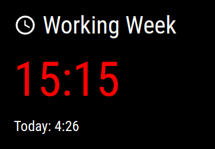
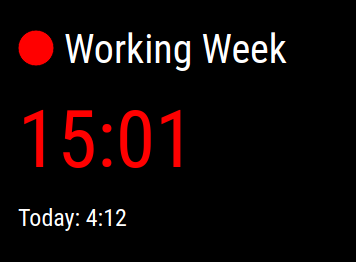

# Magic Mirror² TimeTagger

[English](./README.md)

Este es un módulo de [`Magic Mirror²`](https://magicmirror.builders/) que muestra las últimas horas registradas por [TimeTagger](https://timetagger.app).
TimeTagger es una aplicación de seguimiento del tiempo construida por Almar Klein.

En concreto, muestra los siguientes datos
- horas trabajadas esta semana
- horas trabajadas hoy
- indicador de trabajo en curso (círculo rojo)

Para usar este módulo, necesitas tener una cuenta de [`TimeTagger`](https://timetagger.app). También puedes autoalojar TimeTagger
como se describe en la documentación de TimeTagger.

## Vista previa de la pantalla

Este es un ejemplo de cómo se ve Magic Mirror² TimeTagger en mi configuración:



Vista del trabajo en curso cuando se está haciendo el seguimiento del tiempo:



## Instalación

Clona este repositorio en tu carpeta de `módulos` de MagicMirror.

Ejemplo:

```
cd /home/pi/MagicMirror/modules
git clone https://github.com/tderflinger/MMM-Timetagger.git
```

Instala las dependencias de JavaScript:

```
cd /home/pi/MagicMirror/modules/MMM-Timetagger
npm i
```

Finalmente, edite su archivo de configuración en `config/config.js` con la siguiente configuración.
```
{	
  module: "MMM-Timetagger",
  position: "top_left",
  config: {
	  endpoint: "Tu endpoint de la API Timetagger, así: http://mymachine:8080/timetagger/api/v2",
	  apiToken: "Tu token de API de Timetagger",
	  interval: 300000,  // intervalo de actualización de datos en ms
  },
},
```

## Opciones de configuración

| **Opción** | **Descripción** |
| --- | --- |
| `interval`      | Intervalo entre la obtención de datos del TimeTagger en ms. |
| `endpoint`      | Tu punto final de la API TimeTagger, como este: http://mymachine:8080/timetagger/api/v2 |
| `apiToken`      | Tu token de la API de TimeTagger |


## Pruebas

He probado el módulo `Magic Mirror² TimeTagger` en una Raspberry Pi 3B con Raspberry OS
y Node 16.15.0 y `Magic Mirror²` versión 2.19.0.

## Iconos

El módulo utiliza los siguientes iconos de iconduck.com:

- https://iconduck.com/icons/88028/clock-time-four-outline Licencia Apache

## Software

Magic Mirror²: https://magicmirror.builders

Preact: https://preactjs.com

HTM: https://github.com/developit/htm

Axios: https://axios-http.com/

## Licencia

Licencia MIT
